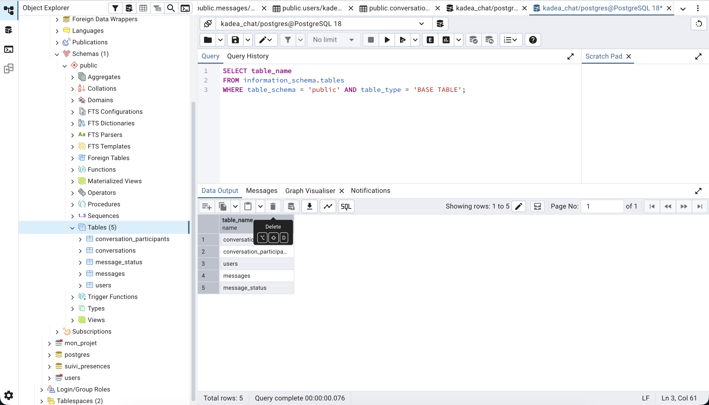

# kadea-chat-db
Projet de conception et de mise en place de la **couche données** de l'application
de messagerie **Kadea Chat** (destinée aux apprenants de Kadea).

Ce livrable fait le lien entre le **frontend** déjà développé et le **futur backend**
qui exposera une API REST au-dessus de cette base PostgreSQL.

---

## Présentation

Kadea Chat est une plateforme de messagerie qui permet aux utilisateurs de :

- créer un compte et se connecter ;
- consulter leurs conversations et leurs messages ;
- envoyer des messages ;
- consulter leur profil.

Ce dépôt contient la **base de données relationnelle** qui permettra au backend de
stocker et de gérer toutes ces informations. Le modèle gère aussi bien les
**conversations privées (1 ↔ 1)** que les **conversations de groupe (N participants)**,
et suit l'état de chaque message **par destinataire** (envoyé / délivré / lu).

---

## Technologies

- **PostgreSQL** — SGBD relationnel
- **pgAdmin** — interface graphique pour exécuter et tester les requêtes
- **Draw.io** (diagrams.net) — modélisation MCD / MLD et dictionnaire de données
- **SQL** — langage de définition et de manipulation des données


---

## Modélisation

Le modèle respecte la **3e forme normale (3FN)** et repose sur 5 tables :

| Table | Rôle | Clé primaire |
|---|---|---|
| `users` | Comptes utilisateurs (apprenants) | `id` |
| `conversations` | Conversations privées ou de groupe | `id` |
| `conversation_participants` | Association N:N utilisateurs ↔ conversations | `(conversation_id, user_id)` |
| `messages` | Messages échangés dans les conversations | `id` |
| `message_status` | État de livraison/lecture par destinataire | `(message_id, user_id)` |

### Principales relations

- Un utilisateur peut participer à **0 ou plusieurs** conversations ; une conversation
  regroupe **1 ou plusieurs** utilisateurs → association **N:N** matérialisée par la
  table `conversation_participants`.
- Une conversation contient **0 ou plusieurs** messages ; un message appartient à
  **une seule** conversation → `messages.conversation_id` (FK).
- Un utilisateur envoie **0 ou plusieurs** messages ; un message est envoyé par
  **un seul** utilisateur → `messages.sender_id` (FK).
- L'état (envoyé / délivré / lu) est **par destinataire** : un même message de groupe
  peut être lu par certains et encore en « envoyé » pour d'autres. C'est pourquoi le
  statut ne vit pas sur le message lui-même mais dans la table `message_status`.

### Contrainte métier notable

Une **clé étrangère composite** garantit que l'auteur d'un message est
obligatoirement participant à la conversation :

```sql
FOREIGN KEY (conversation_id, sender_id)
    REFERENCES conversation_participants (conversation_id, user_id)
```

Ainsi, impossible d'insérer un message au nom d'un utilisateur qui ne participe pas
à la conversation ciblée.

---

## Installation

### Prérequis

- PostgreSQL (15 ou supérieur recommandé)
- pgAdmin 4

### Étapes

Le script `database.sql` est conçu pour s'exécuter en **deux temps** (la commande
`CREATE DATABASE` doit être lancée avant de pouvoir y créer les tables) :

1. **Cloner le dépôt** :

   ```bash
   git clone [https://github.com/veben-cmyk/kadea-chat-db.git](https://github.com/veben-cmyk/kadea-chat-db.git)
    cd kadea-chat-db
   ```

2. **Créer la base de données** `kadea_chat`, puis s'y connecter et y créer les tables.

   **Avec pgAdmin (recommandé)** :
   - Ouvrir le **Query Tool** sur la base `postgres` (ou une base quelconque).
   - Exécuter uniquement : `CREATE DATABASE kadea_chat;`
   - Se connecter à la nouvelle base `kadea_chat` (clic droit → *Query Tool*).
   - Exécuter le **reste du script** (à partir de `CREATE TABLE users ...`).


3. Le fichier `database.sql` contient dans l'ordre :
   - la création de la base ;
   - la création des tables et de toutes les contraintes ;
   - les données d'exemple réalistes ;
   - les requêtes SQL de test.

4. **Vérifier** depuis pgAdmin que les tables apparaissent et que les requêtes
   retournent des résultats (voir la section *Requêtes* ci-dessous).

---

## Draw.io 

[lien Draw.io ](https://viewer.diagrams.net/?tags=%7B%7D&lightbox=1&highlight=0000ff&edit=_blank&layers=1&nav=1&title=modelisation(merise).drawio&page-id=RfXflSii7_TupqB0Iarx&dark=auto#Uhttps://drive.google.com/uc?id=1-Sy0WyC4f2HE64OHz6UkZyhUn6YeL09q&export=download#%7B%22pageId%22%3A%22RfXflSii7_TupqB0Iarx%22%7D)

Le fichier **`docs/kadea_chat_merise.drawio`** contient les **trois onglets obligatoires** :

1. **Dictionnaire de données** — tables, attributs, types PostgreSQL, contraintes, 
   descriptions et caractère obligatoire/facultatif.
2. **MCD** — modèle conceptuel Merise : entités (rectangles), associations (losanges)
   et cardinalités.
3. **MLD** — modèle logique : tables, colonnes, types, clés primaires et étrangères.


---

## Structure du projet

```
kadea-chat-db/
├── database.sql              # Script SQL complet (tables, contraintes, données, tests)
├── README.md                 # Documentation du projet
├── docs/                     # Diagrammes et modélisation
│   └── kadea_chat_merise.drawio # Dictionnaire + MCD + MLD (3 onglets)
└── screenshot/               # Captures d'écran des tests pgAdmin
    ├── 01_structure_tables
    ├── 02-tables.png
    ├── 03-requetes.png
    └── 04-resultats.png
```

---

## Données d'exemple

Le script insère des données réalistes permettant de tester toutes les relations :

- **6 utilisateurs** (Christian, Junior, Sarah, Patrick, Grâce, David) ;
- **4 conversations** : 2 privées + 2 de groupe ;
- **11 participations** ;
- **13 messages** répartis sur les différentes conversations ;
- **26 statuts** de messages (envoyé / délivré / lu) par destinataire.

---


## Captures pgAdmin

## 📸 Captures pgAdmin & Démo

### 1. Structure et Tables



### 2. Exécution des requêtes SQL de test et Résultats obtenus


---

## Auteur

**Isaac Veben** — NovaWeb Studio
Projet Kadea Chat — Base de  données (PostgreSQL)
